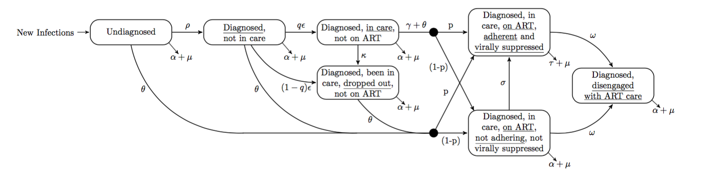

Welcome to the cascade report. This report was generated on `r Sys.time()` from your own simulations. Caution this report is written dynamically, so please report any bugs or issues to [jack.olney11@imperial.ac.uk](mailto:jack.olney11@imperial.ac.uk).

The intention of this report is to act as a reference for any data entered, simulations carried out and results generated. The model is still under active development so caution is advised as results are preliminary.

# Data Review
Combining available data with any additional data entered by the user, the model used the following data on for calibration:

### Cascade Data
The below table describes the entire cascade database used by the model for calibration. It is a tabular representation of what you would have seen on the calibration page. Calibration figures will be printed out ahead.

#

```{r, fig.width = 7, fig.height = 3, fig.align = 'center', echo = FALSE}
    BuildDataReviewPlot_Report(data = MasterData$calib)
```


```{r, fig.width = 7, fig.height = 5, fig.align = 'center', echo = FALSE}
    gridExtra::grid.table(scales::comma(MasterData$calib), rows = NULL)
```

### Incidence Estimates
These incidence estimates were sourced from Spectrum. The model randomly sampled between the upper and lower bounds during calibration to account for uncertainty the in these incidence estimates.
```{r, fig.width = 7, fig.height = 3, fig.align = 'center', echo = FALSE}
    gridExtra::grid.table(scales::comma(MasterData$incidence), rows = NULL)
```

### Country Specific Treatment Guidelines
The impact of country-specific treatment guideline updates must be accounted by the model. We do not describe WHO Stage conditions so CD4 thresholds must be updated to reflect changing guidelines. Guidelines can be changed prior to calibration, and the values used during calibration are shown below.
```{r, fig.width = 7, fig.height = 3, fig.align = 'center', echo = FALSE}
    int <- MasterData$treatment_guidelines
    names(int) <- c("Country", "<200", "<250", "<350", "<500", ">500")
    gridExtra::grid.table(int, rows = NULL)
```

\newpage

### CD4 Distribution Estimates from Spectrum (2010)
To ensure that HIV-mortality rates were accurate, the model uses CD4 distribution estimates from 2010 (when calibration was started)
```{r, fig.width = 7, fig.height = 5, fig.align = 'center', echo = FALSE}
    int <- t(MasterData$cd4)
    proportion <- round(as.numeric(int[2:15,]), digits = 2)
    cd4 <- c(">500", "350-500", "250-350", "200-250", "100-200", "50-100", "<50")
    art <- c(rep("Off ART", 7), rep("On ART", 7))
    gridExtra::grid.table(data.frame(art, cd4, proportion), rows = NULL)
```

\newpage

### CD4 Distribution Estimates from Spectrum (2015)
To ensure that the model retains the correct distribution of CD4 counts across both pre-ART and ART patients, we re-set the model to the 2015 CD4 distribution estimates.
```{r, fig.width = 7, fig.height = 5, fig.align = 'center', echo = FALSE}
    int <- t(MasterCD4_2015)
    proportion <- round(as.numeric(int[2:15,]), digits = 2)
    cd4 <- c(">500", "350-500", "250-350", "200-250", "100-200", "50-100", "<50")
    art <- c(rep("Off ART", 7), rep("On ART", 7))
    gridExtra::grid.table(data.frame(art, cd4, proportion), rows = NULL)
```

\newpage

# Model Calibration

Given all available data, including those values entered by the user, the model used approximate bayesian computation to identify `r input$minResults` parameter sets that produced a total error of less than or equal to `r input$maxError`. The resulting depiction of the cascade in 2015 is shown below:

```{r, fig.width = 7, fig.height = 3, fig.align = 'center', echo = FALSE}
    BuildCalibrationPlot_Report(data = CalibOut, originalData = MasterData)
```

#

A histogram of sampled model errors is shown below, with the maximum threshold shown as a vertical line:

```{r, fig.width = 5, fig.height = 2, fig.align = 'center', echo = FALSE}
    BuildCalibrationHistogram_Report(runError = runError, maxError = input$maxError)
```

\newpage

The cascade distribution in previous years is summarised below:

```{r, fig.width = 7, fig.height = 8, fig.align = 'center', echo = FALSE}
    BuildCalibrationPlotDetail_Report(data = CalibOut, originalData = MasterData, limit = input$minResults)
```
\newpage

### Model Structure

The model has a following structure. Note, this is a simplified view of the structure, for more detail please view the official [model document](https://drive.google.com/file/d/0B02uVauBTUwhckJ1bG1QRmdwTGM/preview).



### Calibrated Parameters

Histograms illustrating where the majority of accepted parameter sets lie:

```{r, fig.width = 7, fig.height = 3, fig.align = 'center', echo = FALSE}
    BuildCalibrationParameterHistGroup()
```

\newpage

# Cascade Projection

## Projected Cascade in 2015 and 2020

```{r, fig.width = 7, fig.height = 3, fig.align = 'center', echo = FALSE}
    GenCascadePlot_Report()
```

#

## Discretised Cascade Projection

```{r, fig.width = 7, fig.height = 3, fig.align = 'center', echo = FALSE}
    GenPowersCascadePlot_Report()
```

\newpage

## UNAIDS 90-90-90

```{r, fig.width = 7, fig.height = 3, fig.align = 'center', echo = FALSE}
    Gen909090Plot_Report()
```

\newpage

## HIV Incidence

```{r, fig.width = 7, fig.height = 3, fig.align = 'center', echo = FALSE}
    GenNewInfPlot_Report(wizard = FALSE)
```

#

## AIDS-related Deaths

```{r, fig.width = 7, fig.height = 3, fig.align = 'center', echo = FALSE}
    GenAidsDeathsPlot_Report(wizard = FALSE)
```

\newpage

# Optimisation \& Interventions

During calibration, we simulate thousands of parameter sets to identify a subset that fit the data
within a certain interval. As a result we are left with `r input$minResults` parameter sets that
could be plausibly true. Now, if we were to then simulate thousands permutations of interventions
on each of these `r input$minResults` parameter sets we would need to millions of simulations, which
what take a considerable amount of time. As one of the aims of this model was to be simple to use
and most importantly fast, we have decided to only simulate interventions on the 'best fitting'
parameter set. That is to say, the parameter set that produces the smallest total model error.

The model identified the following parameters that produced the best fit to available data:

Parameter | Value
----------|---------------------------------------
$\rho$    | `r CalibParamOut[minErrorRun, "rho"]`
$q$       | `r CalibParamOut[minErrorRun, "q"]`
$\gamma$  | `r CalibParamOut[minErrorRun, "gamma"]`
$\theta$  | `r CalibParamOut[minErrorRun, "theta"]`
$\kappa$  | `r CalibParamOut[minErrorRun, "kappa"]`
$\omega$  | `r CalibParamOut[minErrorRun, "omega"]`
$p$       | `r CalibParamOut[minErrorRun, "p"]`

```{r, fig.width = 7, fig.height = 5, fig.align = 'center', echo = FALSE}
    BuildCalibrationBestFitPlot_Report(data = CalibOut, originalData = KenyaData, limit = input$minResults, minErrorRun = minErrorRun)
```

## Interventions

The structure of the model allows us to implement and assess the impact of six broad interventions acting on various elements of the cascade. The interventions are described below along with a table denoting which intervention was active during optimisation.

Intervention      | Active
------------------|----------------------------
Testing           | `r intSwitch$testing`
Linkage           | `r intSwitch$linkage`
Pre-ART Retention | `r intSwitch$preRetention`
ART Initiation    | `r intSwitch$initiation`
ART Adherence     | `r intSwitch$adherence`
ART Retention     | `r intSwitch$retention`

##### HIV Testing
We simulate a broad HIV-testing intervention, that involves increasing the rate at which undiagnosed individuals become diagnosed. As the model does not account for HIV-negative individuals this rate cannot be interpretted as an 'HIV-testing rate', as the true HIV-testing rate would depend on the proportion of postive undiagnosed individuals in the population and would almost certainly be higher. However, this intervention will be able to identify how many more individuals need to be diagnosed per year.

##### Linkage
We simulate a linkage intervention that adjusts the proportion of diagnosed individuals that link to care. After diagnosis, a proportion ($q$) of infected individuals link to pre-ART care at a rate (epsilon) determined during calibration. However, $1-q$ individuals fail to link to care and are lost to follow-up; although, all individuals have the propensity to seek care at a rate determined by their current health state. As an individual's CD4 count declines, they seek care at a higher rate.

##### Pre-ART Retention
During calibration, a rate of loss from pre-ART care for diagnosed individuals is derived ($kappa$). We simulate a pre-ART retention intervention that reduces pre-ART loss by lowering the pre-ART loss rate, kappa. This keep patients engaged in pre-ART care and increases the likelihood that they will initiate ART.

##### ART Initiation
Our ART initiation intervention involves increasing the rate at which diagnosed individuals engaged in pre-ART care start treatment. This rate is initially derived during calibration, but is also dependent upon country specific treatment guidelines. For example, an individual will not initiate ART with a CD4 count of >500 if the national guidelines only suggest ART for persons with CD4 <350.

##### Adherence
Upon initiating ART, a proportion ($p$) of patients adhere to treatment and become virally suppressed. However, $1-p$ individuals do not adhere to treatment and HIV progresses as if they were treatment naive. We implement an adherence intervention by allowing non-adherent persons on treatment to start adhereing at some rate, sigma. Prior to the intervention, this rate is zero, and no individuals progress from non-adherent to adherent states.

##### ART Retention
Finally, we simulate an intervention that reduces loss to follow-up for persons on treatment. During calibration we derive a baseline rate at which individuals are lost from ART care, omega. We simulate an intervention by reducing this rate of loss from care. Additionally, this rate applies to both adherent and non-adherent persons on ART.


## UNAIDS 90-90-90 Achievement

Goal                                          | Optimised Estimate by 2020
----------------------------------------------|--------------------------------------------------------------------------
90\% of PLHIV diagnosed                       | `r scales::percent(round(Get909090(optResult)[,"90"],       digits = 2))`
90\% of diagnosed on treatment                | `r scales::percent(round(Get909090(optResult)[,"90-90"],    digits = 2))`
90\% of those on treatment virally suppressed | `r scales::percent(round(Get909090(optResult)[,"90-90-90"], digits = 2))`

If all three targets can be achieved or exceeded by 2020, then the cheapest route to 90-90-90 will be displayed. The total additional cost of care to achieve these goals between 2015 and 2020 will be shown along with the changes that must be made to care. In the event that all three targets are not able to be achieved through implementing interventions, then the simulation producing the closest result will be displayed, along with its cost and required changes to care.

Change            | Description                                            | Value
------------------|--------------------------------------------------------|--------------------------------
Cost              | Additional cost of care per year between 2015 and 2015 | `r report_909090_cost`
Testing           | Additional diagnoses per year                          | `r report_909090_testing`
Linkage           | Additional linkage per year                            | `r report_909090_linkage`
Pre-ART Retention | Reduction in losses from pre-ART care per year         | `r report_909090_preRetention`
ART Initiation    | Additional ART initiations per year                    | `r report_909090_initiation`
ART Adherence     | Additional non-adherence transitions per year          | `r report_909090_adherence`
ART Retention     | Reduction in losses from ART care per year             | `r report_909090_retention`

If you would like to review the full list of all simulated interventions, please return to the optimisation results tab and click 'View Results' where the tables are able to be exported as a csv file, an excel spreadsheet, a pdf or printed directly.

#
**Thanks you for using the HIV Modelling Consortium Cascade Estimation App.**
